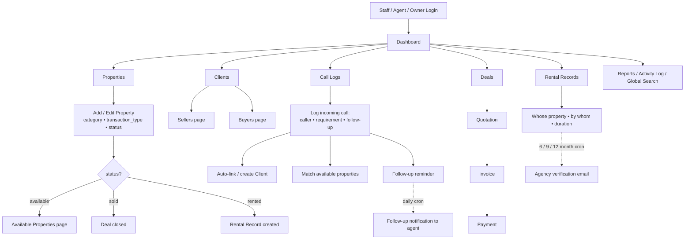

# Agency — Real Estate Management System

A full-featured, multi-tenant real estate agency management platform built with Laravel. It runs multiple independent agencies ("companies") under a single installation — each with isolated data, users, and settings — alongside a public-facing, bilingual (EN/UR) property listing website and secure client/tenant/owner portals.

---

## Table of Contents

1. [Features](#features)
2. [Technology Stack](#technology-stack)
3. [Roles & Permissions](#roles--permissions)
4. [Architecture & Multi-Company Design](#architecture--multi-company-design)
5. [Modules](#modules)
6. [Portals](#portals)
7. [Public Website](#public-website)
8. [Local Installation](#local-installation)
9. [Configuration Reference](#configuration-reference)
10. [Scheduled Tasks & Cron](#scheduled-tasks--cron)
11. [Production Deployment](#production-deployment)
12. [Security](#security)
13. [License](#license)

---

## Features

### Platform & Tenancy
- **Multi-Company support** — register new agencies; each is an isolated tenant
- **Role-based access control** — `super_admin`, `admin`, `agent`
- **Per-company data isolation** via global model scopes
- **Company management** — super-admins create/edit companies, switch between tenants, and create admin users per company
- **Registration** — self-service sign-up creates a company and its first admin account

### Public Website
- Property listings with search and filters
- Hero slider managed from the admin settings
- Bilingual (English / Urdu)
- About, privacy, terms pages, and SEO `sitemap.xml`
- Contact form and per-property enquiry forms

### Real-Estate Operations
- **Properties** — full CRUD, media galleries (primary-image control), documents, owner/agent assignment, listing expiry, view counts
- **Clients** — profiles with attached documents
- **Deals** — sale/rental deals, token (bayana) management, trash/restore, CSV export
- **Property visits** — scheduling with client/agent assignment and status filters
- **Cities** — managed list for listing metadata

### Financials
- **Quotations** — versioning, mark-sent, client approval workflow, PDF export
- **Invoices** — standalone or converted from quotations, payment tracking (paid/unpaid/outstanding), PDF export
- **Payments** — central payments ledger with edit/delete
- **Installment plans** — per-deal plans with per-installment payments (mark paid)
- **Commissions** — record and mark paid
- **Agent payouts** — with payout receipts
- **Expenses** — recorded company expenses
- **Recurring invoices** — scheduled auto-generation

### Property Management (Rent)
- **Rent agreements** — rent terms, deposit settlement, renewal, regeneration
- **Rent schedules** — regenerate schedule / generate-next-month
- **Rent payments** — mark paid/waive, printable receipts
- **Rent notices** — issue and respond

### Operations Tools
- **Reports** — sales (with PDF export), agent performance, commissions, rent
- **Global search** — cross-module admin toolbar search
- **Activity log** — audit trail
- **Item templates** — reusable line items for quotations/invoices

### Client-Facing Portals
- **Client portal** — quotations, invoices, properties, deals, documents
- **Tenant portal** — rent dashboard, agreements, notices, receipts
- **Owner portal** — properties, income, tenant overview

### Settings
Configurable per company: business info, branding (logo/slider/favicon), email/SMTP, payment/bank details, real estate defaults, SMS, and website content.

---

## Technology Stack

| Layer | Technology |
|-------|------------|
| Backend | PHP 8.3+, Laravel 13 |
| Database | MySQL / MariaDB |
| Frontend | Blade templates, Bootstrap 5, Tabler Icons, Vanilla JS |
| Image handling | GD extension (crop-and-save to WebP) |
| PDF generation | Server-side PDF rendering |
| Auth | Session-based auth, email verification, password reset |

---

## Roles & Permissions

| Role | Scope | Description |
|------|-------|-------------|
| `super_admin` | Platform | Platform owner. Can create/edit/switch between companies, manage every company, and sees all admin features. |
| `admin` | Own company | Full management of their own company's data and settings. |
| `agent` | Own company | Day-to-day operations (properties, deals, clients) without company settings. |

Middleware:
- **`role:{role}`** route middleware (`CheckRole`) enforces the role.
- Blade **gates** (`@can('admin')`) control UI visibility. `super_admin` passes all admin-level gates.
- The **client portal** uses its own `portal.auth` middleware and is fully isolated from the admin panel.

---

## Architecture & Multi-Company

Each model inherits `App\Traits\BelongsToCompany`, which:

1. **Reads scoping** — adds a global scope `WHERE company_id = <current>` so every query only sees the active company's records.
2. **Writes scoping** — auto-assigns `company_id` when a record is created.

The current company is resolved by `current_company_id()` (in `app/helpers.php`):

- A logged-in `super_admin` uses the company selected in the session (switchable).
- A logged-in `admin`/`agent` uses their own `company_id`.
- The public website (no user) falls back to the default company.
- Console/CLI jobs fall back to a company stored in session or the default company.

A `companies` table holds each tenant, and all 30 domain tables carry a `company_id` column.

---

## Modules

| Module | Controllers | Notable routes |
|--------|--------------|----------------|
| Properties | `PropertyController` | `/properties`, media, documents |
| Clients | `ClientController` | `/clients` |
| Deals | `DealController` | `/deals`, export, trash/restore |
| Tokens | `TokenController` | `/tokens` |
| Quotations | `QuotationController` | `/quotations`, versions, PDF |
| Invoices | `InvoiceController` | `/invoices`, convert, PDF, payments |
| Payments | `PaymentController` | `/payments` |
| Installments | `InstallmentController` | `/installments` |
| Rent agreements | `RentAgreementController` | `/rent-agreements`, renew, deposit |
| Rent payments | `RentPaymentController` | `/rent-payments`, receipts |
| Rent notices | `RentAgreementController` | notices respond |
| Property visits | `PropertyVisitController` | `/property-visits` |
| Commissions | `CommissionController` | `/commissions` |
| Agent payouts | `AgentPayoutController` | `/agent-payouts` |
| Expenses | `ExpenseController` | `/expenses` |
| Cities | `CityController` | `/cities` |
| Agents | `AgentController` | `/agents` |
| Contacts/Enquiries | `ContactController` | `/contacts` |
| Item templates | `ItemTemplateController` | `/settings/items` |
| Settings | `SettingsController` | `/settings` |
| Reports | `ReportController` | `/reports/*` |
| Activity log | `ActivityLogController` | `/admin/activity-log` |
| Companies | `CompanyController` | `/companies` |
| Search | `SearchController` | `/search` |
| Profile | `ProfileController` | `/profile` |

---

## Local Installation

### Requirements

- PHP 8.3+
- MySQL / MariaDB
- Composer
- GD extension (image cropping)
- Extensions: `fileinfo`, `gd`, `mbstring`, `openssl`, `pdo_mysql`

### Steps

```bash
# 1. Clone & enter project
git clone <repository-url> agency
cd agency

# 2. Install PHP dependencies
composer install

# 3. Environment setup
cp .env.example .env
php artisan key:generate

# 4. Configure the database in .env
#    DB_DATABASE=agency_db
#    DB_USERNAME=root
#    DB_PASSWORD=

# 5. Create the storage symlink
php artisan storage:link

# 6. Migrate + seed (creates default company, accounts, and sample data)
php artisan migrate --seed

# 7. Start the local server
php artisan serve
```

Visit: `http://127.0.0.1:8000`

**Default accounts** (after `--seed`):

| Role | Email | Password |
|------|-------|----------|
| Super Admin (platform owner) | `superadmin@agency.com` | `password` |
| Admin (default company) | `admin@agency.com` | `password` |

The **default company** *Prime Property Agency* and a `DummyDataSeeder` dataset are created by the seeders.

---

## Configuration Reference

Key `.env` variables:

```env
APP_URL=http://localhost:8000
APP_DEBUG=true

DB_CONNECTION=mysql
DB_HOST=127.0.0.1
DB_PORT=3306
DB_DATABASE=agency_db
DB_USERNAME=root

SESSION_DRIVER=database
SESSION_ENCRYPT=true

QUEUE_CONNECTION=database
CACHE_STORE=database

MAIL_MAILER=log            # set to 'smtp' in production
MAIL_HOST=smtp.gmail.com
MAIL_PORT=587
MAIL_USERNAME=
MAIL_PASSWORD=
MAIL_FROM_ADDRESS=
```

> **Note:** `MAIL_MAILER=log` logs emails to the Laravel log instead of sending. Switch to `smtp` and set a real provider for production (see below).

---

## Scheduled Tasks & Cron

The app defines scheduled commands (in `routes/console.php`). Run the scheduler once a minute:

```
* * * * * cd /path-to-project && php artisan schedule:run >> /dev/null 2>&1
```

| Command | Schedule | Purpose |
| --- | --- | --- |
| `rent:sync-overdue` | daily | Mark overdue rent payments |
| `rent:expire-agreements` | daily | Expire ended rent agreements |
| `rent:send-notifications` | daily | Send rent reminders/notifications |
| `invoices:generate-recurring` | daily | Auto-generate recurring invoices |
| `queue:work --stop-when-empty` | every minute via `bootstrap/app.php` | Process queued jobs (mail etc.) |

The scheduler requires `php artisan schedule:run` to be triggered by the OS scheduler (cron) or a process manager.

---

## Production Deployment

### Environment

```env
APP_ENV=production
APP_DEBUG=false
APP_URL=https://yourdomain.com
LOG_LEVEL=warning
SESSION_ENCRYPT=true
SESSION_SECURE_COOKIE=true
```

### Mail (send real email)

```env
MAIL_MAILER=smtp
MAIL_HOST=smtp.gmail.com
MAIL_PORT=587
MAIL_USERNAME=you@example.com
MAIL_PASSWORD=your-app-password
MAIL_ENCRYPTION=tls
MAIL_FROM_ADDRESS="noreply@yourdomain.com"
MAIL_FROM_NAME="Agency"
```

### Queue & scheduler

Run a worker for mail/jobs (or the every-minute `queue:work` scheduled shape):

```bash
php artisan queue:work --daemon
```

and the scheduler as described in [Scheduled Tasks & Cron](#scheduled-tasks--cron).

### Web server

- Point the document root to the `public/` directory.
- Apache uses the provided `.htaccess`.
- Nginx:
  ```nginx
  location / {
      try_files $uri $uri/ /index.php?$query_string;
  }
  ```

### TLS

Terminate HTTPS at the web server / load balancer. The app trusts proxies automatically (`trustProxies(at: '*')`) for correct URL generation.

---

## Security

- Encrypted `session` data (database driver)
- Cross-site request forgery (CSRF) protection on all forms
- Rate limiting: login (5/min) and contact form (3/min)
- Auth required on all admin routes
- Role gates + route-level `role:` middleware
- Multi-company isolation via global scopes
- Client portal isolated from admin/backend
- Password reset (expiring tokens) and email verification flow

---

## License

Proprietary. All rights reserved.

---

## CMS Working Flowchart

> **Note:** This system was refactored into an **internal Property CMS for a single agency**. The public website, client/tenant/owner portals, full rent-management, and installment modules described in the earlier sections above have been removed. The flow below reflects the **current working system**.

### High-level flow (Mermaid)



### Text flow

1. **Login & access** — Only agency staff log in (Owner / Admin / Agent roles & permissions). No public site, no client portals.
2. **Properties** — Add a property with `category` (house, plot, farmhouse, agricultural land, flat, studio apartment, office, shop), `transaction_type` (sale, buy, rent, installment) and `status` (available, rented, sold). Available properties feed the *Available Properties* page.
3. **Clients** — Managed as **Sellers** and **Buyers** via dedicated pages. A caller in a Call Log is auto-linked to an existing client, or a new client is created on the fly.
4. **Call Logs (core)** — Every incoming call is recorded with the caller, requirement, and a follow-up date. The *Match* view links the requirement to currently available properties so no lead is lost. A daily cron sends follow-up reminders to agents.
5. **Deals & financials** — Deals produce Quotations → Invoices → Payments. Commissions, agent payouts, and expenses are tracked.
6. **Rental Records (slim)** — When a property is rented, a simple Rental Record captures *whose property, rented by whom, for how long* — no rent payments. A staggered 6/9/12-month cron emails the agency to verify the property is still rented.
7. **Dashboard, search & crons** — Unified dashboard shows KPIs (properties, sellers/buyers, call logs, follow-ups due, rentals). Global search spans modules. Crons: `rent:verify-status`, `call:followups`, recurring invoices, backup.